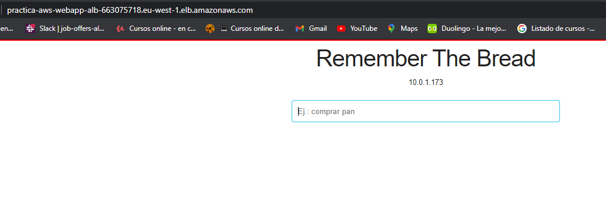

# PRÁCTICA FINAL AWS

Práctica del Bootcamp DevOps III de Keepcoding.

## REQUISITOS

- AWS CLI.

- Cuenta en AWS.

- Terraform.

## CONFIGURACIÓN DE CREDENCIALES

Primero, debemos crear un usuario con el servicio IAM de aws.

Una vez creado, debemos configurar nuestros credenciales de usuario AWS.

Introducimos el comando:

```aws configure --profile (username)```

Gracias a esto, ya tenemos nuestro perfil asociado a nuestra cuenta y la región que le especifiquemos (eu-west-1).

Para finalizar esta parte, configuramos una variable de entorno para que terraform use nuestro perfil por defecto.

El siguiente comando sólo funcionaria para usuarios de windows en cmd.

```C:\> setx AWS_PROFILE (username)```

## KEY PAIR

Una vez realizado el apartado anterior, para crear el key pair en local, ejecutaremos:

```ssh-keygen -t rsa -b 4096 -C "practica-aws-ec2-kp"```
```ssh-keygen -f practica-aws-ec2-kp -p -m PEM```

Nos pedirá que introduzcamos un directorio donde crear el key par. 

```./practica-aws-ec2-kp```


## DESPLEGAR ARQUITECTURA

Si hemos configurado todo correctamente, podemos iniciar nuestro proyecto de terraform con:

```terraform init```

Y posteriormente, para desplegar la arquitectura:

```terraform apply```

De esta manera ya tenemos desplegada nuestra aplicación. 

Para finalizar, terraform nos dará un output con la DNS del balanceador, que deberemos introducir en nuestro navegador para visualizar.

```http://practica-aws-webapp-alb-663075718.eu-west-1.elb.amazonaws.com/```

